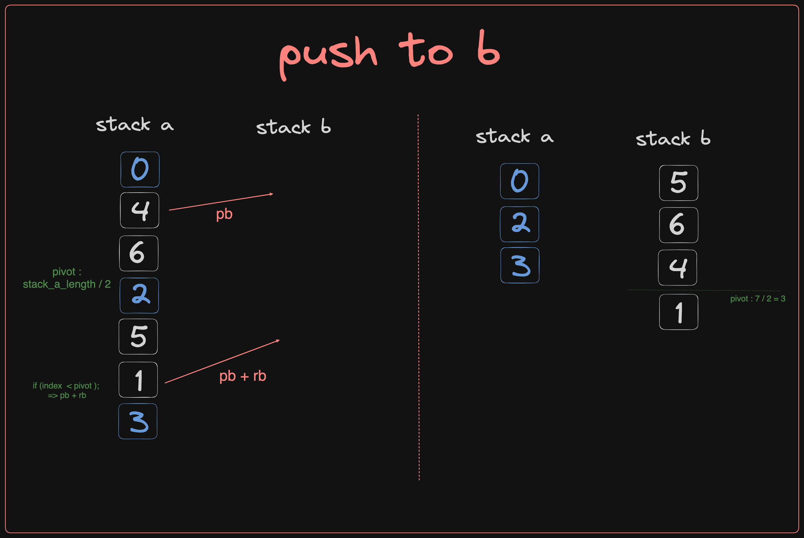

# Push_Swap

This project involves sorting data on a stack with a limited set of instructions, aiming to use the lowest possible number of actions.

The Push swap project is a straightforward algorithm project where stack must be sorted. We have a set of integer values, 2 stacks, and a set of instructions to manipulate both stacks.

## Methodology

The algorithm I chose for this project is a mix between finding the Longest Increasing Subsequence (LIS), pushing numbers that don't belong to LIS into stack B, then pushing back to stack A the number that has the least number of instructions / the best move. Using this method, I validated this project with a full mark of 100% with 25% extra for bonus. 
(The bonus part will not be explained in this README since it's not very complicated to implement)

## Rules

You have 2 stacks named a and b.

- At the beginning:
  - The stack a contains a random amount of negative and/or positive numbers which cannot be duplicated.
  - The stack b is empty.
- The goal is to sort numbers in ascending order into stack a. To do so, you have the following operations at your disposal:

  - `sa` (swap a): Swap the first 2 elements at the top of stack a. Do nothing if there is only one or no elements.
  - `sb` (swap b): Swap the first 2 elements at the top of stack b. Do nothing if there is only one or no elements.
  - `ss`: `sa` and `sb` at the same time.
  - `pa` (push a): Take the first element at the top of b and put it at the top of a. Do nothing if b is empty.
  - `pb` (push b): Take the first element at the top of a and put it at the top of b. Do nothing if a is empty.
  - `ra` (rotate a): Shift up all elements of stack a by 1. The first element becomes the last one.
  - `rb` (rotate b): Shift up all elements of stack b by 1. The first element becomes the last one.
  - `rr`: `ra` and `rb` at the same time.
  - `rra` (reverse rotate a): Shift down all elements of stack a by 1. The last element becomes the first one.
  - `rrb` (reverse rotate b): Shift down all elements of stack b by 1. The last element becomes the first one.
  - `rrr`: `rra` and `rrb` at the same time.

## Overview

The project follows a three-step methodology to achieve its objectives:

1. Indexing
2. Find the Longest Increasing Subsequence
3. Calculate the best move
4. In Case we have less than 5 numbers (special case)

### 1. Indexing

- We first put all numbers in a stack a with index initialized to -1. In my case, I chose linked lists to hold my stacks.
- We sort the values in an array to get the proper indexes that we're gonna work with.
- And as a final step, we assign each node in the stack to its index according to the sorted array as explained in the picture below.

### 2. Find the Longest Increasing Subsequence

A Longest Increasing Subsequence (LIS) is the longest sequence of numbers in an array where each number is greater than the previous one.

- This video explains perfectly how to find the longest increasing subsequence: [link](https://www.youtube.com/watch?v=E6us4nmXTHs&t=643s)
- To follow up with the example that we began with here is a schema that explains how we found our LIS.

### 3. Calculate the Best Move

In this step, we should have stack a with the LIS in it and the other numbers are in stack b.

Pushing numbers back to stack a must not be arbitrary to get the desired results. To do it in a proper way, we calculate the total cost of each move and then opt for the cheapest one (fewer instructions). For that, each node in stack b has:
  - a "position" (simply its place in the stack)
  - a "target_position" (the position of the closest bigger number in stack a)
  - a "cost" (how many moves it requires to get to the top of stack b)
  - a "target_cost" (how many moves the target requires to get to the top of stack a).

For the cost if the node is below the pivot (the middle index in the stack) it gets "rra" and a single move "rra" gets -1 as value. If the node is above the pivot, it gets "ra" and a single move "ra" gets 1 as value.

- The total cost is the absolute value of "cost" + absolute value "target_cost".
- By the end, we should have a total cost of every move then we choose the one with fewer instructions and execute it.

We update costs after every move until we have the stack b empty. To make sure everything is sorted, we check if index 0 is at the top of a; if not, we rotate/reverse rotate (do the below or above pivot thing) until it's there.

### 4. Sort less than five

In case we have initially less than five numbers in the stack, we don't need to use our Algo to sort them because it will just take a lot of moves.

- For 3 numbers, the cases are very limited as shown in the picture, so it will be easy to implement `sort_three()` function to sort them.
- For 5 or 4 numbers, all we have to do is to push the first indexes from stack a to stack b in a reverse order, and push them back after applying `sort_three()` on stack a.
